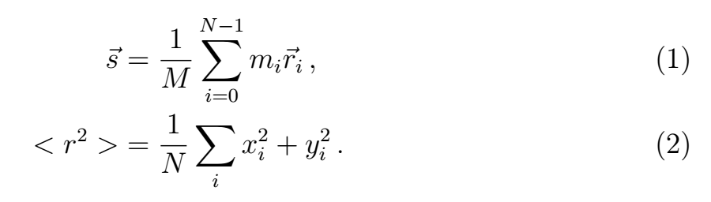

## Lab class 4

This problem considers two-dimensional free diffusion of particles that perform a random motion. We consider *N* particles that all start in the origin of the coordinate system *(0,0)*. In each time step, every particle moves the same distance r=1, but each one moves in a different, random direction. All directions should be considered equally probable.

After a certain time we want to plot the positions of all the particles and some statistical properties of their coordinates, in particular their center of mass
and the mean square displacement (MSD).



The code you obtain at the start contains already some infrastructure.
Get familiar with it.

We begin by simulating *Nt = 100* timesteps for *N = 500* particles. After each
timestep we calculate the coordinate of the center of mass and the MSD.

Things that are missing are:
* The function `push(...)` that takes all particles and advances their coordinates
 **one timestep**. Propagate every particle forward by a distance of *r=1* into
 a random direction.

* The function `statistics(...)` should take all particles and calculate their
mean square displacement, i.e. the mean value of the squared distances of
the particles from the origin. Additionally the function has to calculate
the position of the center of mass. 
The output of these statistical values should also be generated in this
function. Print the current time, MSD and the center of mass coordinates
to the terminal. Later we can redirect this output to a file via the terminal
and then investigate the MSD as a function of time.


-----

### Generating uniform random numbers

A common way to generate uniform random numbers is to use the function `rand()`
from `cstlib`. This function returns an integer between 0 and RAND_MAX, where 
RAND_MAX is a variable from `cstdlib`. In order to generate a uniform random distribution of `double` values between 0 and 1, one can then simply use
```C++
double r = rand()/double(RAND_MAX);
```
In this problem we will use, only for the reason of simplicity, this mechanism.
However, be aware that for any real production code for a simulation or whatever,
you should **never** use this. In this way you get random values which are not 
really totally uniform. There are specific cases where uniformity is violated.

Since C++11 the correct way would be to use the `random` extension. Uniform `double` values would be obtained via
```C++
#include <random>

int main(void){
    // Example for uniform random values
    std::default_random_engine gen;
    std::uniform_real_distribution<double> dist(0.0,1.0);

    // Generate a random value
    double x = dist(gen);

    return 0;
}
```

